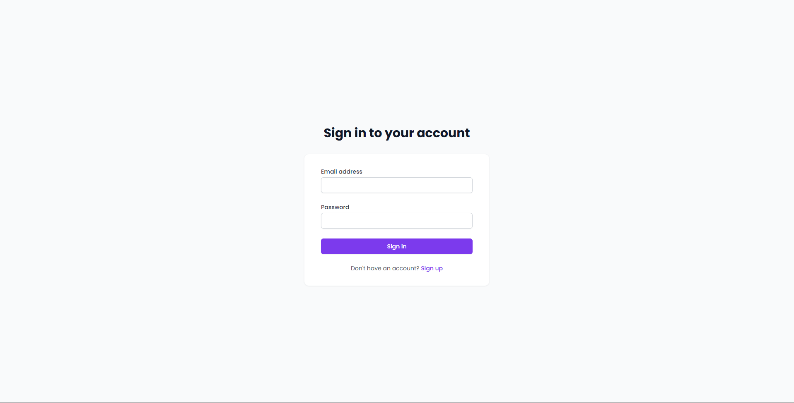
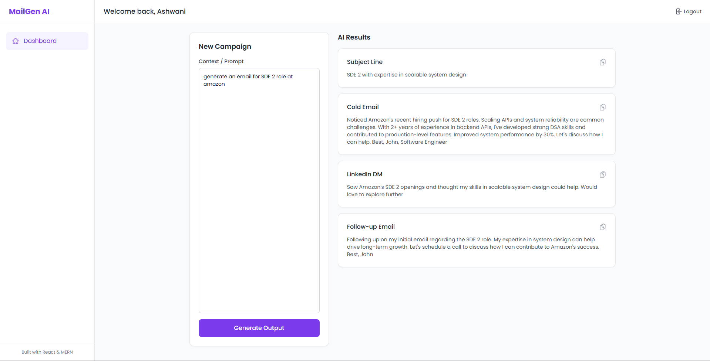

# SmartMail AI

AI-powered cold email generator with OTP authentication and personalized outreach generation.

---

## Features

- AI-generated cold emails
- OTP email authentication
- JWT-based login system
- MongoDB database integration
- Responsive modern UI
- Copy-to-clipboard functionality
- Secure API integration with Groq AI

---

## Tech Stack

### Frontend
- React
- Vite
- Tailwind CSS

### Backend
- Node.js
- Express.js
- MongoDB

### AI
- Groq API

---

## Screenshots

### Landing Page


### Authentication


### OTP Verification


### Dashboard


### Generated Email


---

## Installation

### Clone Repository

```bash
git clone YOUR_GITHUB_REPO_LINK
```

---

### Backend Setup

```bash
cd server
npm install
npm run dev
```

---

### Frontend Setup

```bash
cd client
npm install
npm run dev
```

---

## Environment Variables

Create a `.env` file inside the `server` folder.

Required variables:

```env
MONGODB_URI=
JWT_SECRET=
EMAIL_USER=
EMAIL_PASS=
GROQ_API_KEY=
FRONTEND_URL=
```

---

## Future Improvements

- Multi-model AI support
- Email templates
- Export as PDF
- Email history tracking
